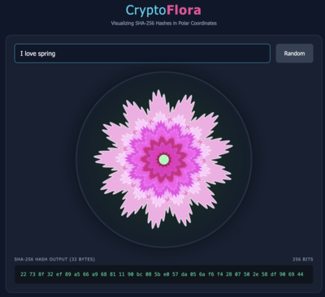

# CryptoFlora

A beautiful web-based tool that visualizes SHA-256 hashes as unique botanical art using rose curves.

## Screenshot



## Overview

CryptoFlora transforms any text input into a unique flower-like visualization by mapping SHA-256 hash bytes to various artistic parameters. Each hash produces a completely unique piece of art, demonstrating the deterministic yet unpredictable nature of cryptographic hash functions.

## Features

- **Real-time Hash Visualization**: Type any text and instantly see its SHA-256 hash rendered as botanical art
- **Deterministic Art**: The same input always produces the same visual output
- **Random Generation**: Click the "Random" button to generate random word combinations
- **Download Support**: Save your generated flowers as PNG images
- **Responsive Design**: Works beautifully on desktop and mobile devices

## How It Works

The application uses different bytes from the 32-byte SHA-256 hash to control various aspects of the visualization:

### Geometry (Bytes 0-4)

- **Byte 0**: Base petal count (3-14 petals)
- **Byte 1**: Shape factor (sharpness vs roundness, 0.5-2.5)
- **Byte 2**: Layer count (3-8 layers)
- **Byte 3**: Global rotation offset
- **Byte 4**: Composite blending mode trigger

### Color Palette (Bytes 5-12)

- **Bytes 5-6**: Base hue (full 360° color spectrum)
- **Byte 7**: Saturation (60-100%)
- **Bytes 8-9**: Harmonic frequency and amplitude
- **Byte 10**: Background glow hue

### Mutation & Details (Remaining Bytes)

- **Various bytes**: Layer-specific variations
- **Bytes 28-31**: Central detail (stamen/pistil area)
  - Center radius
  - Number of decorative dots

### Rose Equation

The petals are drawn using a modified rose curve equation:

```
r = radius + amp × |cos(k × θ / 2)|^shapeFactor + harmonicNoise
```

Where:

- `r` = distance from center
- `θ` = angle in radians
- `k` = petal count
- `shapeFactor` = controls sharpness
- `amp` = amplitude (petal size)
- `harmonicNoise` = additional sine wave for organic variation

## Use Cases and Ideas

1. **Icebreakers**: Use the tool in social settings to generate flowers from attendees' names or favorite words, and attendees can gather other people with matching flowers, or can collect flowers by scanning QR codes to make a bouquet.
2. **Gifts**: Generate personalized flower art based on names or messages.
3. **Digital Art**: Create unique digital artworks for personal use or NFTs.
